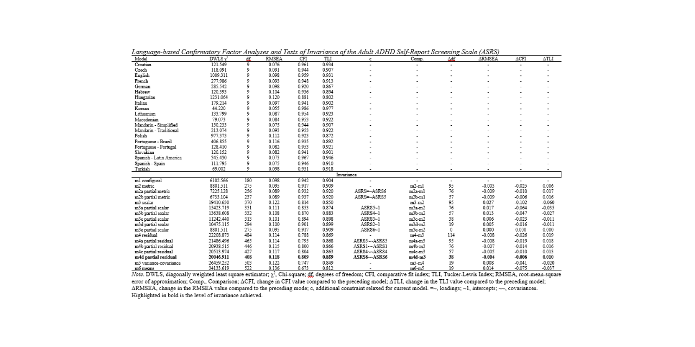

# Cross-cultural validation in the International Sex Survey (ASRS)

This repository contains the analysis code, output, and checkpoints for the cross-cultural adult ADHD assessment using the Adult ADHD Self-Report Scale (ASRS) Screener as part of the International Sex Survey (2021/2022). 

The study was conducted across 42 countries and is described in the following paper:

Lewczuk, K., Marcowski, P., ... Bőthe, B. (2024). Cross-Cultural Adult ADHD Assessment in 42 Countries Using the Adult ADHD Self-Report Scale Screener. *Journal of Attention Disorders, 28*(4), 512–530. [https://doi.org/10.1177/10870547231215518](https://doi.org/10.1177/10870547231215518)

Visit the project on the Open Science Framework (OSF) [here](https://osf.io/uyfra/).

## Table of Contents

- [Overview](#overview)
- [Repository Structure](#repository-structure)
- [Requirements](#requirements)
- [Usage](#usage)
- [Data](#data)
- [Analysis](#analysis)
- [Results](#results)
- [Citation](#citation)
- [License](#license)
- [Contact](#contact)

## Overview

This project analyzes data from the International Sex Survey (2021/2022), focusing on the assessment of Adult ADHD across 42 countries using the Adult ADHD Self-Report Scale (ASRS) Screener. The analysis includes data preparation, psychometric evaluation, and cross-cultural comparisons.

## Repository Structure

```
iss-asrs-study/
│
├── checkpoints/
│
├── data/
│   ├── raw/
│   └── prepared/
│
├── output/
│
├── R/
│   └── helpers.R
│
├── prepare_data.R
├── run_analysis.R
├── LICENSE
└── README.md
```

**Summary of the repository structure:**

`checkpoints/`: Contains intermediate results and saved states of the analysis.

`data/`: Stores study data.

&nbsp;&nbsp;&nbsp;`raw/`: Contains unprocessed data.

&nbsp;&nbsp;&nbsp;`prepared/`: Contains preprocessed data ready for analysis.

`output/`: Contains the results of the analysis, including tables and figures used in the paper.

`R/`: R scripts for data preprocessing and analysis.

&nbsp;&nbsp;&nbsp;`helpers.R`: Contains helper functions used in the analysis.

`prepare_data.R`: Script for preprocessing the raw data.

`run_analysis.R`: Main script for running the analysis on the prepared data.

## Requirements

To run the analysis, you will need an R environment and the following packages:

```
install.packages(c("tidyverse", "lavaan", "semTools", "tidySEM", "patchwork", "haven", "sjlabelled"))
```

(see header of each script for additional requirements)

## Usage

1. Clone this repository:
   ```
   git clone https://github.com/pmarcowski/iss-asrs-study.git
   ```
2. Navigate to the project directory:
   ```
   cd iss-asrs-study
   ```
3. Run the R scripts in the root directory in the following order:
   - `prepare_data.R`
   - `run_analysis.R`

### Data

The data used in this study is not included in this repository and can be requested from the corresponding author of the paper. Once obtained, place the raw data file (`iss_asrs.sav`) in the `data/raw/` directory before running the analysis scripts.

### Analysis

The analysis includes:

- Data preprocessing and cleaning
- Descriptive statistics
- Confirmatory Factor Analysis (CFA)
- Measurement invariance testing
- Reliability analysis (Cronbach's alpha, McDonald's omega)
- Cross-cultural comparisons
- Gender differences analysis

### Results

Analysis outputs, including tables and figures, are saved in the `output/` directory.

## Citation

If you use this code or results in your research, please cite:

Lewczuk, K., Marcowski, P., ... Bőthe, B. (2024). Cross-Cultural Adult ADHD Assessment in 42 Countries Using the Adult ADHD Self-Report Scale Screener. *Journal of Attention Disorders, 28*(4), 512–530. [https://doi.org/10.1177/10870547231215518](https://doi.org/10.1177/10870547231215518)

## License

This project is licensed under the MIT License - see the [LICENSE](LICENSE) file for details.

## Contact

For any questions or feedback, please contact the author directly.
